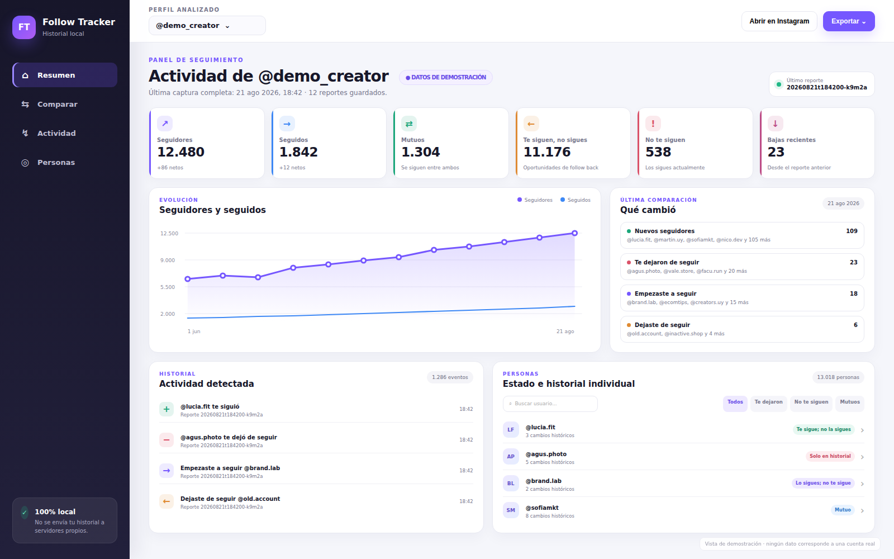
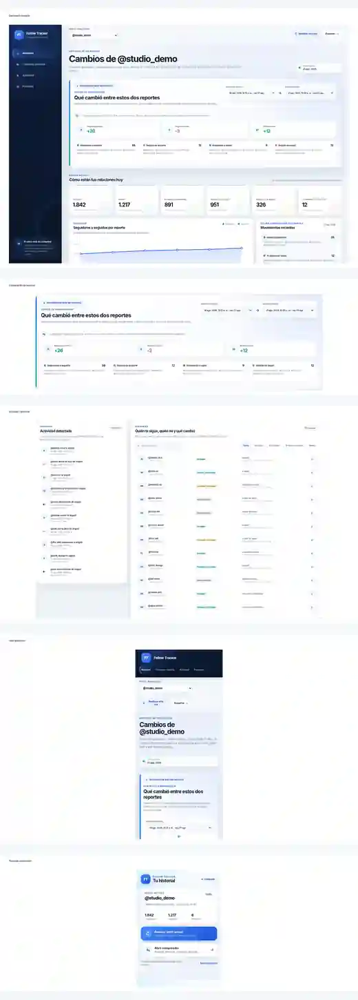
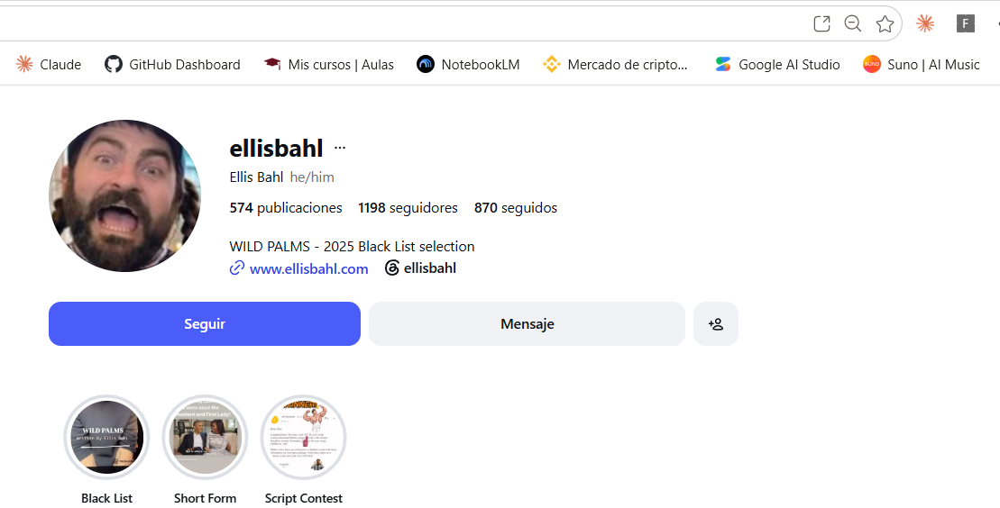
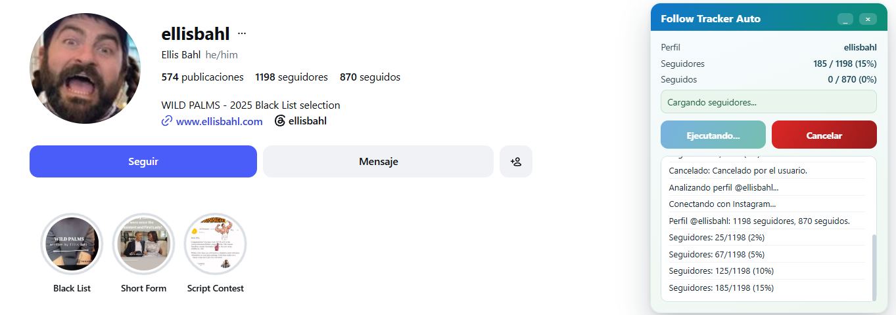
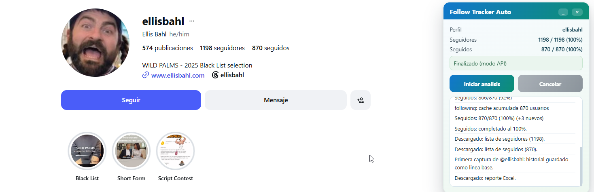

<div align="center">

# Follow Tracker

### Compará reportes de Instagram y entendé exactamente qué cambió

[](#instalación)
[](#desarrollo)
[](LICENSE)

Extensión de navegador que guarda capturas de seguidores y seguidos, compara cualquier par de reportes y conserva un historial por persona, fecha y cambio detectado.

</div>

> [!IMPORTANT]
> **El valor principal está en la comparación.** Una sola captura muestra el estado actual; dos reportes permiten saber quién empezó a seguirte, quién dejó de seguirte, a quién empezaste a seguir, a quién dejaste de seguir y cómo cambió cada relación.

> [!NOTE]
> Follow Tracker no está afiliado con Instagram ni Meta. Trabaja sobre la sesión que ya está abierta en el navegador y puede necesitar mantenimiento cuando Instagram modifica su interfaz o sus endpoints internos.

## Vista completa del producto

La pantalla principal prioriza la comparación entre capturas y deja visibles, en un mismo recorrido, el estado actual, la evolución, los movimientos recientes y las relaciones por persona. Todos los perfiles y números son ficticios.

<p align="center">
  
</p>

La siguiente composición reúne el dashboard, la comparación detallada, la actividad, las personas, la vista adaptable y el popup de la extensión.

<p align="center">
  
</p>

## Qué podés descubrir

| Pregunta | Respuesta del dashboard |
|---|---|
| ¿Quién empezó a seguirme? | Usuarios agregados a seguidores entre el reporte inicial y el final |
| ¿Quién me dejó de seguir? | Usuarios eliminados de seguidores entre ambos reportes |
| ¿A quién empecé a seguir? | Cuentas agregadas a tu lista de seguidos |
| ¿A quién dejé de seguir? | Cuentas eliminadas de tu lista de seguidos |
| ¿Quién me sigue y yo no? | Relación actual **Te sigue; no lo seguís** |
| ¿A quién sigo y no me sigue? | Relación actual **Lo seguís; no te sigue** |
| ¿Quiénes son mutuos? | Personas que se siguen en ambos sentidos |
| ¿Qué pasó con una persona concreta? | Historial individual con evento, fecha y reporte |

Además, permite:

- comparar cualquier par de capturas guardadas, aunque no sean consecutivas;
- ver la evolución de seguidores y seguidos por reporte;
- consultar la última comparación automáticamente;
- revisar todos los eventos en orden cronológico;
- buscar personas y filtrar relaciones;
- conservar perfiles separados;
- exportar backup JSON, actividad CSV y relaciones CSV;
- descargar automáticamente los dos CSV crudos de cada captura.

## Cómo funciona

```text
Primer análisis  →  crea la línea base
Segundo análisis →  detecta altas y bajas
Nuevos análisis →  amplían el historial y permiten comparar fechas distintas
```

Una captura parcial no reemplaza la línea base ni genera falsos unfollows. La fecha de cada evento es la fecha en la que **el reporte detectó el cambio**; la extensión no puede conocer el instante exacto en que otra persona pulsó seguir o dejar de seguir entre dos capturas.

## Cómo leer el frontend

### 1. Comparación entre reportes

Es la sección principal del dashboard. Seleccioná una captura en **Reporte inicial** y otra en **Reporte final** para obtener:

- balance neto de seguidores;
- balance neto de seguidos;
- variación de relaciones mutuas;
- personas que empezaron a seguirte;
- personas que dejaron de seguirte;
- cuentas que empezaste a seguir;
- cuentas que dejaste de seguir.

Los reportes no tienen que ser consecutivos. Por ejemplo, podés comparar el primer reporte del mes contra el último.

### 2. Estado actual

Las tarjetas resumen el reporte más reciente:

| Indicador | Significado |
|---|---|
| Seguidores | Total actual de personas que te siguen |
| Seguidos | Total actual de cuentas que seguís |
| Mutuos | Ambos se siguen |
| Te siguen; no seguís | Te siguen, pero vos no seguís esas cuentas |
| No te siguen | Las seguís, pero no te siguen de vuelta |
| Bajas recientes | Personas que dejaron de seguirte en la última comparación |

### 3. Evolución

El gráfico muestra cómo cambiaron los totales de seguidores y seguidos a lo largo de todas las capturas completas.

### 4. Actividad y personas

La actividad ordena los eventos desde el más reciente. Cada fila incluye usuario, tipo de cambio, fecha y reporte. La sección de personas permite:

- buscar por nombre de usuario;
- filtrar mutuos;
- filtrar cuentas que no te siguen;
- filtrar personas que te siguen y no seguís;
- filtrar quienes te dejaron de seguir;
- abrir el historial individual de cada persona.

Una cuenta que dejó de seguirte no desaparece del historial aunque ya no figure entre tus seguidores actuales.

## Pantallas de instalación

<table>
  <tr>
    <td width="50%"><strong>1. Abrir extensiones</strong><br></td>
    <td width="50%"><strong>2. Activar modo desarrollador</strong><br></td>
  </tr>
  <tr>
    <td width="50%"><strong>3. Cargar la carpeta extension</strong><br></td>
    <td width="50%"><strong>4. Fijar el icono</strong><br></td>
  </tr>
</table>

## Pantallas del análisis

<table>
  <tr>
    <td width="50%"><strong>Panel sobre Instagram</strong><br></td>
    <td width="50%"><strong>Perfil listo para analizar</strong><br></td>
  </tr>
  <tr>
    <td width="50%"><strong>Análisis en ejecución</strong><br></td>
    <td width="50%"><strong>Análisis finalizado</strong><br></td>
  </tr>
</table>

## Instalación

`main` es la fuente de distribución del proyecto. No se publican ejecutables ni instaladores.

### Opción 1: descargar el ZIP

1. Abrí **Code** en GitHub.
2. Pulsá **Download ZIP**.
3. Descomprimí el repositorio.
4. Abrí `chrome://extensions` o `edge://extensions`.
5. Activá **Modo desarrollador**.
6. Pulsá **Cargar descomprimida**.
7. Seleccioná la carpeta `extension/`.
8. Fijá Follow Tracker en la barra del navegador.

### Opción 2: clonar el repositorio

```bash
git clone https://github.com/viceKDK/Follow-Tracker.git
cd Follow-Tracker
```

Después, cargá `extension/` como extensión descomprimida.

## Uso

1. Iniciá sesión en Instagram en el mismo navegador.
2. Abrí un perfil con formato `instagram.com/usuario/`.
3. Pulsá el icono de Follow Tracker.
4. Seleccioná **Analizar perfil actual**.
5. Mantené la pestaña abierta mientras se recorren seguidores y seguidos.
6. Al finalizar se descargan los dos CSV y se abre automáticamente el dashboard.
7. Repetí el análisis más adelante para crear otra captura.
8. Abrí **Comparar reportes** y elegí las fechas que quieras revisar.

El análisis intenta primero el modo API y, si no obtiene cobertura suficiente, utiliza el recorrido visual de las listas como fallback.

## Categorías y eventos

| Categoría o evento | Significado |
|---|---|
| Mutuo | Ambos se siguen actualmente |
| Te sigue; no lo seguís | La persona te sigue, pero vos no |
| Lo seguís; no te sigue | Vos la seguís, pero ella no |
| Te siguió | Apareció en seguidores desde el reporte anterior |
| Te dejó de seguir | Desapareció de seguidores desde el reporte anterior |
| Empezaste a seguir | Apareció en seguidos desde el reporte anterior |
| Dejaste de seguir | Desapareció de seguidos desde el reporte anterior |
| Solo en historial | Ya no aparece en las listas actuales, pero conserva eventos anteriores |

Ejemplo de evento:

```text
@beto — Te dejó de seguir
21/08/2026 15:30
Reporte: 20260821t153000-ab123
```

## Privacidad y almacenamiento

Todo se procesa y almacena en el navegador mediante `chrome.storage.local`.

- No existe backend propio.
- No se crea una cuenta de Follow Tracker.
- No se envía el historial a servidores del proyecto.
- Los permisos se limitan a la pestaña activa, almacenamiento, inyección del content script y acceso a `instagram.com`.
- `unlimitedStorage` evita perder historiales grandes por la cuota local predeterminada del navegador.

Borrar la extensión o usar **Borrar historial de este perfil** elimina los datos correspondientes. Las exportaciones descargadas deben borrarse manualmente cuando ya no se necesiten.

## Exportaciones

Cada análisis completo descarga automáticamente dos CSV identificados por el mismo `run_id`:

```text
ig_auto_<perfil>_followers_<run_id>_<timestamp>.csv
ig_auto_<perfil>_following_<run_id>_<timestamp>.csv
```

Desde el dashboard también se pueden descargar:

- **Backup JSON:** captura actual, línea base, reportes y eventos completos.
- **Actividad CSV:** usuario, evento, fecha, reporte y `run_id`.
- **Relaciones CSV:** estado actual de cada usuario.

## Modelo de datos

La extensión mantiene dos registros por perfil:

```text
ft_history_<perfil>   -> captura completa actual
ft_timeline_<perfil>  -> reportes y eventos históricos
```

La línea temporal guarda una captura base y, después, los cambios de cada reporte. De esa forma puede reconstruir capturas antiguas sin duplicar miles de usuarios en cada ejecución.

Cada reporte conserva:

```text
id / runId
capturedAt
followersCount
followingCount
mutualCount
newFollowers
lostFollowers
newFollowing
lostFollowing
```

Cada evento conserva:

```text
username
type
occurredAt
reportId
runId
```

## Estructura

```text
extension/
  manifest.json       Configuración Manifest V3
  icons/              Iconos 16/32/48/128 px
  background.js       Mensajería, badge y persistencia
  content.js          Extracción API/UI y panel de progreso
  core.js             Comparación y utilidades puras
  history.js          Reportes, eventos y migración
  export-policy.js    Exportaciones y enlace al dashboard
  popup.*             Inicio rápido y acceso al comparador
  dashboard.*         Métricas, gráficos, comparación y personas

docs/
  dashboard-showcase.webp  Recorrido visual completo del frontend
  dashboard-demo.png      Captura individual del dashboard
  01-extensions.png       Página de extensiones
  02-dev-mode.png         Modo desarrollador
  03-load-unpacked.png    Carga de la carpeta extension
  04-pin-icon.png         Extensión fijada
  05-overlay.png          Panel sobre Instagram
  07-profile-open.png     Perfil abierto
  08-analysis-running.png Análisis en progreso
  09-analysis-finished.png Análisis finalizado

tests/e2e/               Pruebas del flujo de extracción
.github/workflows/ci.yml Integración continua
```

## Desarrollo

Requisitos:

- Node.js 20 o superior;
- Chromium para las pruebas E2E.

```bash
npm ci
npx playwright install chromium
npm test
npm run check
npm run e2e:fixture
npm run e2e
```

## Limitaciones conocidas

Instagram puede imponer pausas, devolver errores `429`/`503`, ocultar cuentas suspendidas o informar un contador distinto al número de filas entregadas. Por eso:

- no se promete una duración fija;
- no se debe cerrar la pestaña ni cambiar de perfil durante el análisis;
- solo una captura con cobertura suficiente actualiza el historial;
- una cuenta privada solo puede analizarse cuando la sesión activa tiene acceso a sus listas;
- el modo visual es más lento que el modo API;
- el funcionamiento puede cambiar cuando Instagram actualiza su web.

La extensión no realiza follows, unfollows, mensajes ni acciones masivas.

## Licencia

MIT. Consultá [`LICENSE`](LICENSE).
