<h1 align="center">
  Follow Tracker&nbsp;
</h1>

<p align="center">
  Extensión local para comparar seguidores y seguidos de Instagram entre dos fechas.
</p>

<p align="center">
  <strong>Chrome y Edge · Manifest V3 · Versión 3.0.0</strong>
</p>

> [!IMPORTANT]
> Follow Tracker es un proyecto independiente. No está afiliado, patrocinado ni aprobado por Instagram o Meta.

## Qué hace

Follow Tracker guarda capturas locales de los seguidores y seguidos de un perfil y compara cómo cambió cada relación con el tiempo.

- Muestra quién empezó o dejó de seguirte.
- Detecta a quién seguís sin reciprocidad y quién te sigue sin que lo sigas.
- Compara cualquier reporte anterior con uno más reciente.
- Revisa cobertura, fuente y anomalías antes de guardar una captura.
- Reduce falsos positivos exigiendo dos ausencias completas consecutivas para confirmar una baja.
- Reconoce cambios de nombre de usuario cuando Instagram proporciona un identificador estable.
- Importa los archivos JSON de la descarga oficial de Instagram.
- Exporta CSV, crea backups y permite recuperar reportes.
- Incluye notas, etiquetas y personas fijadas.

Todo el historial permanece en tu navegador: la extensión no necesita un servidor propio.

## Vista previa

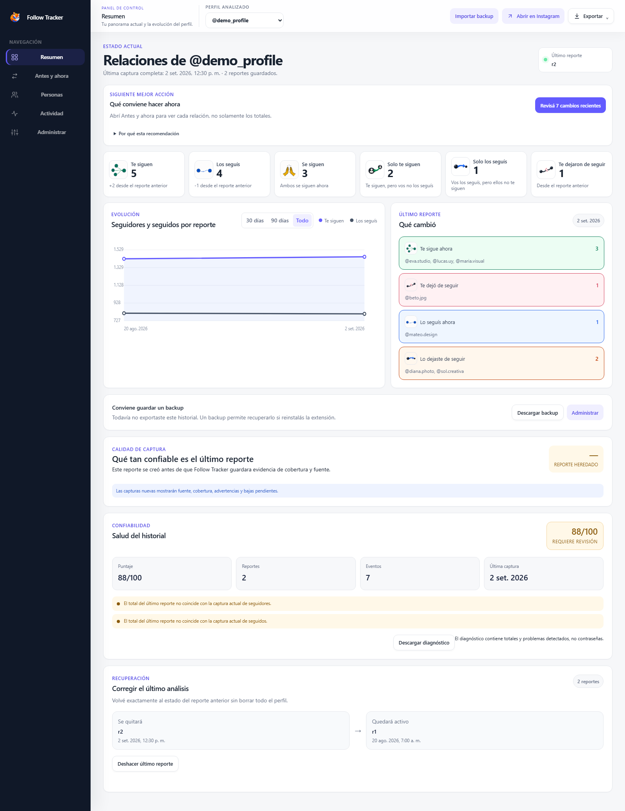

<details>
<summary><strong>Antes y ahora</strong></summary>

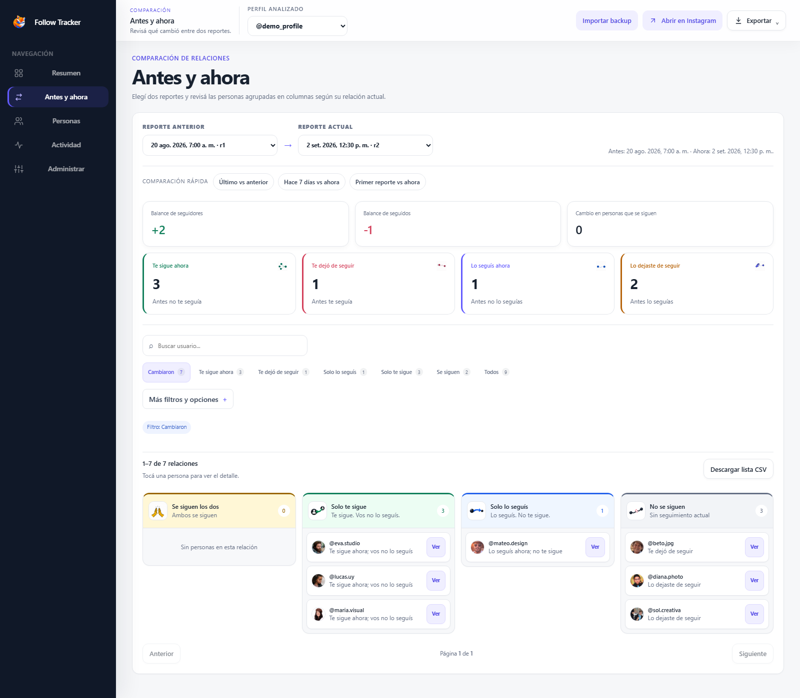

</details>

<details>
<summary><strong>Personas</strong></summary>

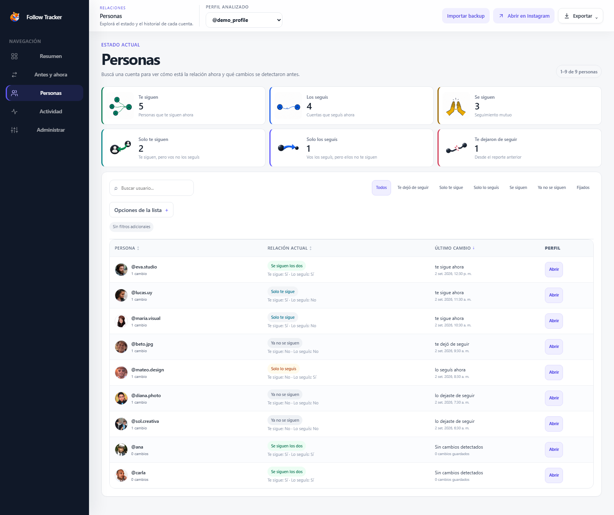

</details>

<details>
<summary><strong>Actividad</strong></summary>

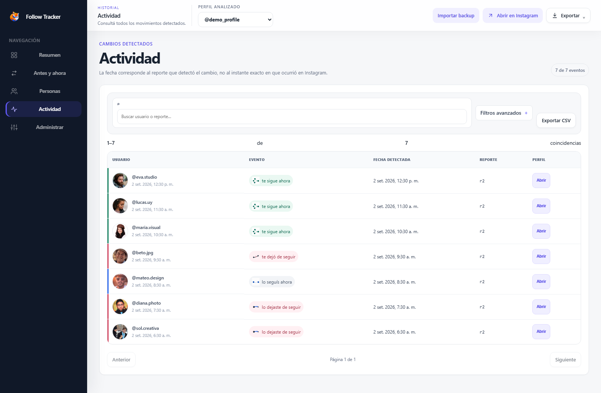

</details>

<details>
<summary><strong>Administrar</strong></summary>

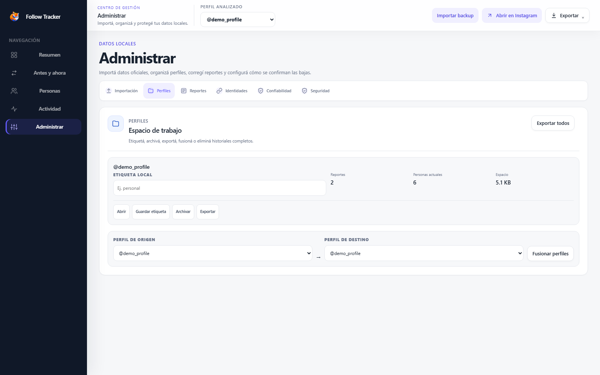

</details>

## Descargar e instalar

No necesitás usar la terminal.

### 1. Descargar el proyecto

[**Descargar Follow Tracker como ZIP**](https://github.com/viceKDK/Follow-Tracker/archive/refs/heads/main.zip)

También podés pulsar el botón verde **Code** de esta página y elegir **Download ZIP**.

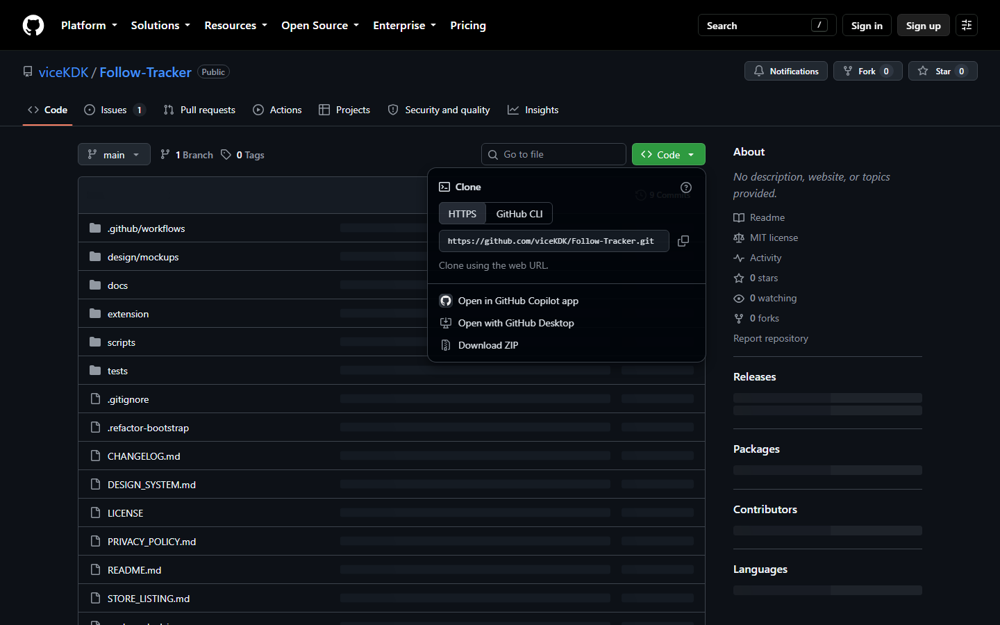

### 2. Extraer el archivo

Abrí la carpeta Descargas, hacé clic derecho sobre `Follow-Tracker-main.zip` y elegí **Extraer todo…**.

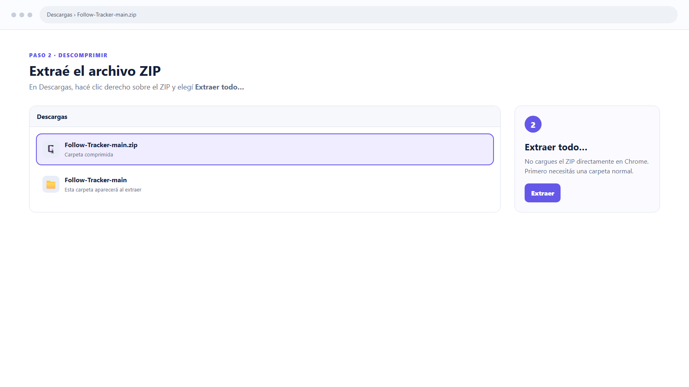

### 3. Cargar la extensión

1. Abrí `chrome://extensions` o `edge://extensions`.
2. Activá **Modo desarrollador**.
3. Pulsá **Cargar descomprimida**.
4. Seleccioná `Follow-Tracker-main/extension`.

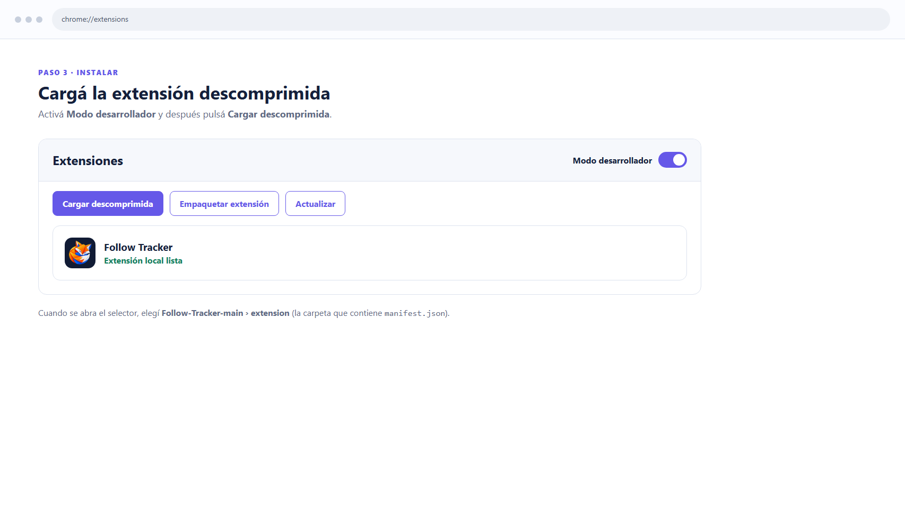

> [!WARNING]
> No selecciones el ZIP ni la carpeta `Follow-Tracker-main`. La carpeta correcta es `extension`, porque contiene `manifest.json`.

### 4. Fijar el icono

Abrí el menú de extensiones del navegador y fijá **Follow Tracker** para tener su icono siempre visible.

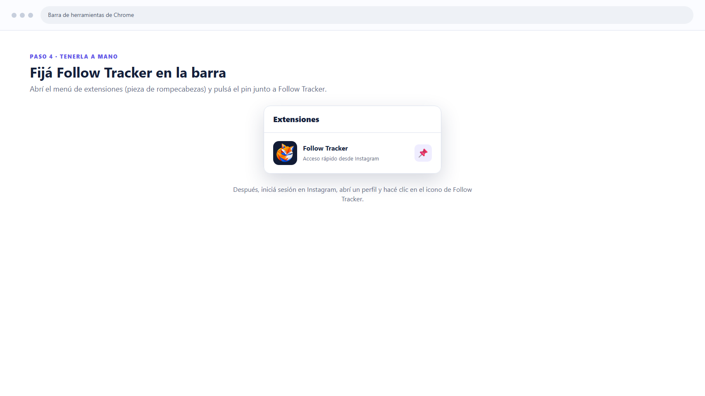

## Cómo usar la extensión

Las capturas siguientes reproducen el proceso sobre el perfil público `@ellisbah1`, utilizado anteriormente para la demostración.

### 1. Abrir un perfil

Iniciá sesión en Instagram, visitá el perfil que querés analizar y pulsá el icono de Follow Tracker. La extensión mostrará el usuario detectado.

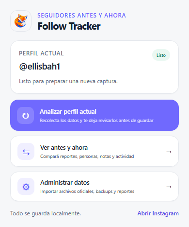

### 2. Iniciar el análisis

Elegí **Analizar perfil actual** y mantené esa pestaña abierta mientras Follow Tracker recopila seguidores y seguidos.

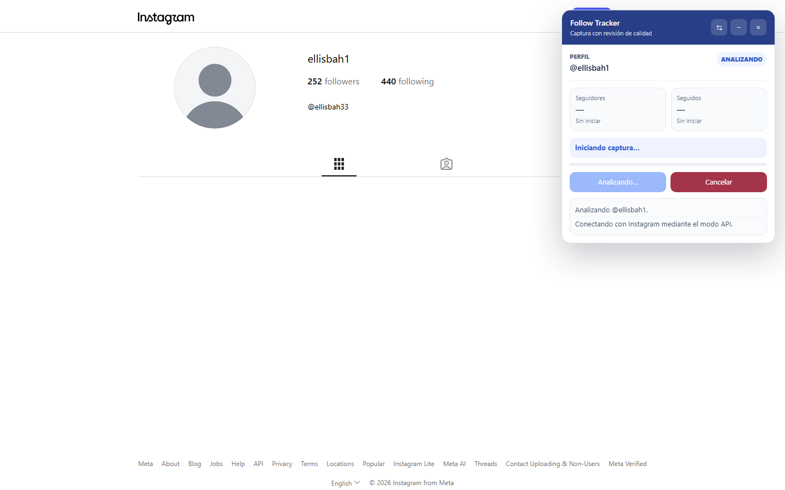

### 3. Revisar la captura

Antes de modificar el historial, comprobá la cobertura, la puntuación de calidad y cualquier advertencia. Podés guardar el reporte, conservarlo como sospechoso o descartarlo.

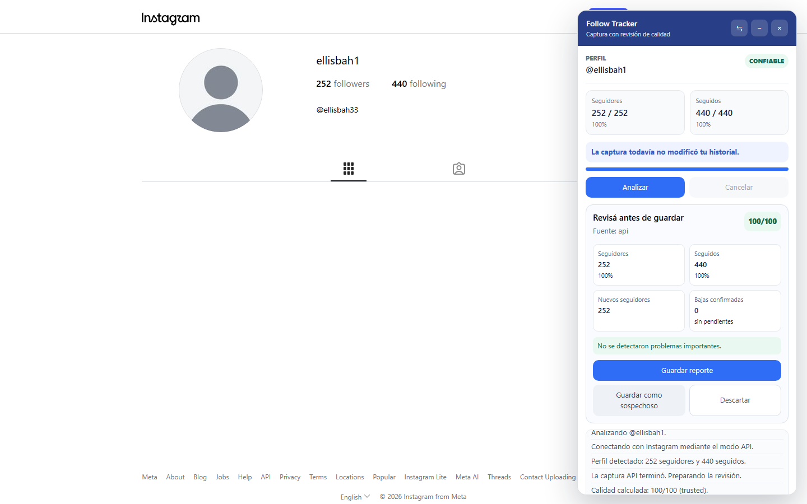

### 4. Guardar y comparar

Guardá el reporte cuando los datos sean confiables. Después podés abrir **Ver antes y ahora** para compararlo con capturas anteriores.

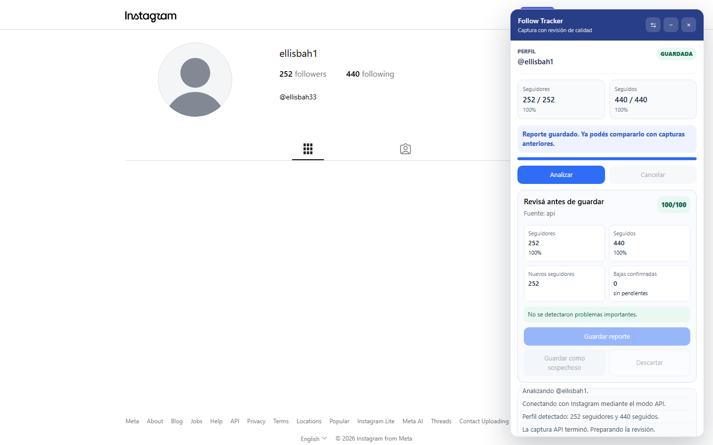

La primera captura funciona como línea de base. Los cambios aparecen cuando guardás una captura posterior del mismo perfil.

## Cómo protege el historial

Una captura nueva no reemplaza automáticamente el último estado válido: primero queda pendiente de revisión.

Por defecto, una cuenta debe faltar en dos capturas completas consecutivas antes de marcarse como baja confirmada. Una captura incompleta o anómala se puede descartar o guardar como sospechosa sin transformar faltantes dudosos en unfollows definitivos.

## Importación oficial de Instagram

La opción **Administrar → Importación oficial** permite importar los archivos JSON entregados por Instagram. Es una alternativa útil cuando la interfaz o los límites de Instagram impiden completar una captura normal.

## Privacidad y permisos

Los datos se guardan en `chrome.storage.local` dentro del navegador.

- No existe un backend propio.
- No se almacena la contraseña de Instagram.
- No realiza follows, unfollows, mensajes ni publicaciones.
- No incorpora analytics ni seguimiento de uso.
- Solo genera archivos cuando exportás o creás un backup manualmente.
- Utiliza `activeTab`, `storage` y acceso limitado a `instagram.com`.

Consultá la [política de privacidad](PRIVACY_POLICY.md).

## Solución de problemas

- **Chrome no carga la extensión:** verificá que seleccionaste la carpeta `extension` que contiene `manifest.json`.
- **No aparece el icono:** abrí el menú de extensiones y fijá Follow Tracker.
- **No comienza el análisis:** confirmá que iniciaste sesión y que la pestaña muestra un perfil de Instagram.
- **La captura parece incompleta:** mantené la pestaña abierta, revisá las advertencias y no confirmes bajas dudosas.

## Instalación con Git (opcional)

```bash
git clone https://github.com/viceKDK/Follow-Tracker.git
cd Follow-Tracker
```

Después cargá la carpeta `extension/` desde la página de extensiones del navegador.

## Desarrollo

Requiere Node.js 20 o superior.

```bash
npm ci
npx playwright install chromium
npm test
npm run check
npm run e2e:fixture
npm run e2e
npm run package
```

Comandos adicionales:

- `npm run preview:dashboard`: abre los datos de demostración del dashboard.
- `npm run capture:readme`: regenera todas las capturas del README con dimensiones reproducibles.
- `npm run package`: crea el ZIP instalable y sus archivos de verificación dentro de `dist/`.

## Estructura del proyecto

```text
extension/   extensión, dashboard y lógica de dominio
scripts/     validaciones, capturas y empaquetado
tests/       pruebas end-to-end
docs/        arquitectura, migraciones, integridad y recuperación
```

## Limitaciones

Instagram puede cambiar sus endpoints, límites o interfaz sin aviso. Follow Tracker combina API, fallback visual, importación oficial, revisión previa y backups, pero no puede garantizar el instante exacto en que ocurrió un follow o unfollow.

## Documentación

- [Índice técnico](docs/README.md)
- [Migración a 3.0](docs/MIGRATION-3.0.md)
- [Recuperación](docs/RECOVERY.md)
- [Listado para la tienda](STORE_LISTING.md)
- [Historial de cambios](CHANGELOG.md)
- [Licencia MIT](LICENSE)
