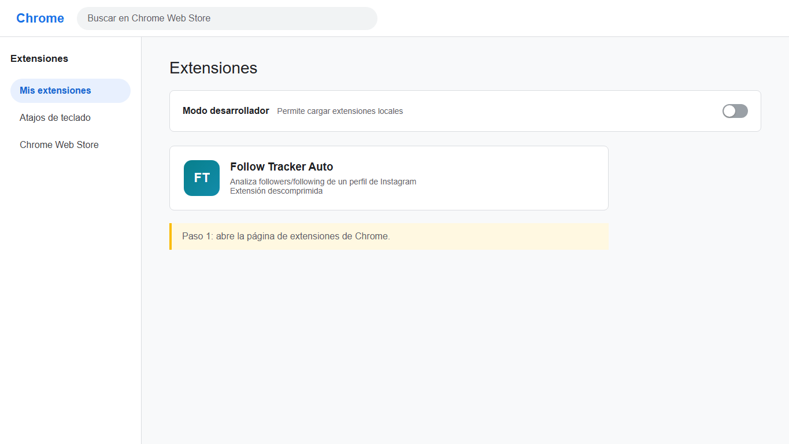
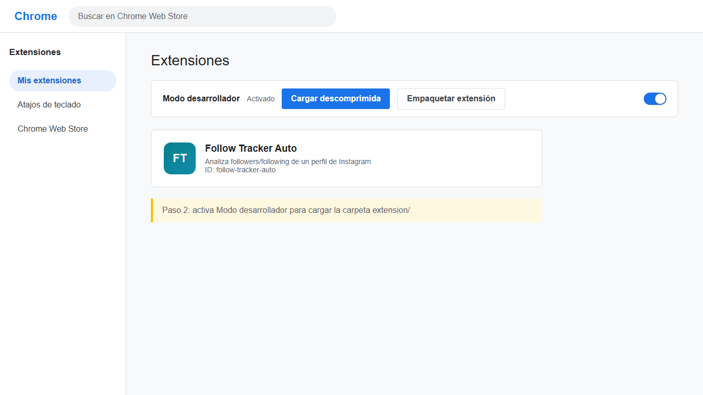
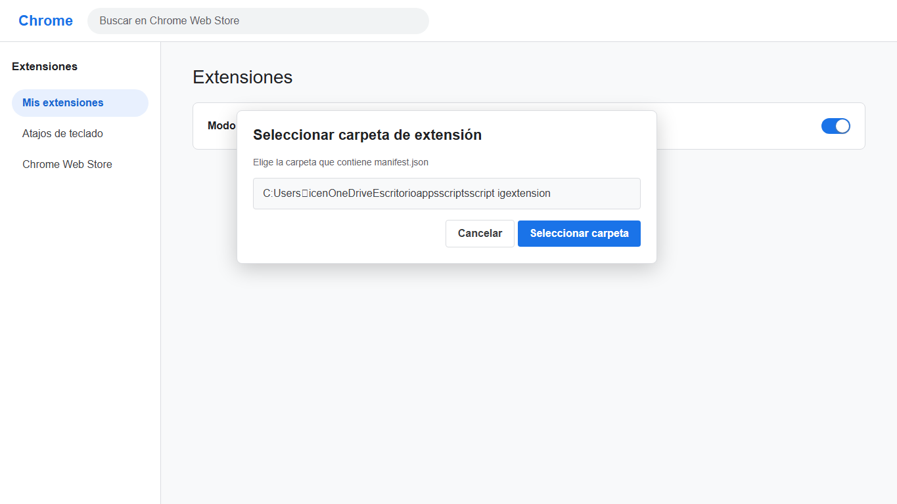
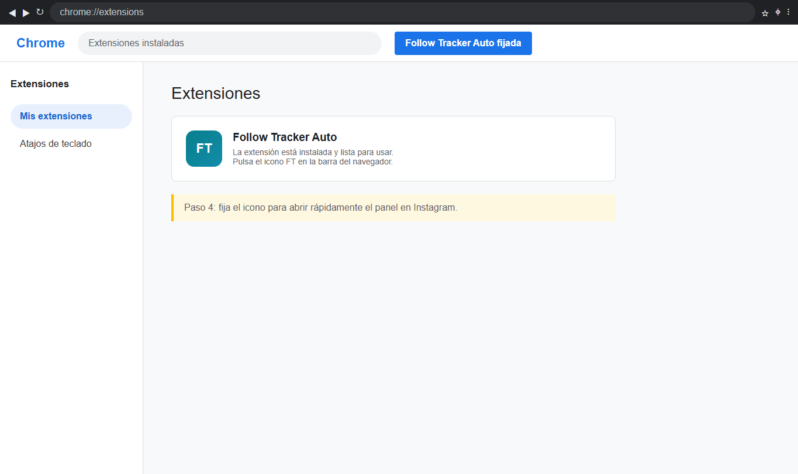
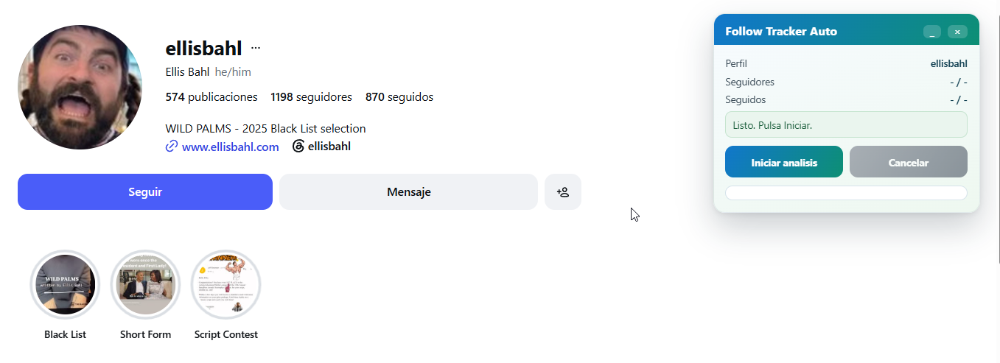

# Follow-Tracker


Herramienta para comparar seguidores y seguidos de Instagram.

## Novedades

- Flujo `1 solo EXE` con modo `AUTO 1-click (esperar)`.
- Extensión de navegador `1 clic` sin consola (`extension/`).
- Carpeta fija `yo/` para tus JSON descargados de Instagram.
- Scraper automático por perfil externo: primero `followers`, luego `following`.
- En extensión: panel flotante fijo durante ejecución, con botón `X` para cerrarlo manualmente.
- Detección del total esperado del perfil (`esperado=<n>`) y recuperación automática si hay estancamiento.
- Reporte final con `Ultimo Scrapeo`.

## Uso 0 pasos técnicos (Extensión)

Recomendado para usuario final.

### Video tutorial

[](https://youtu.be/TU_VIDEO_ID)

> Reemplaza `TU_VIDEO_ID` con el ID de tu video unlisted.

### Pasos con capturas

| # | Acción | Captura |
|---|--------|---------|
| 1 | Abre `chrome://extensions` (o `edge://extensions`) |  |
| 2 | Activa **Modo desarrollador** (esquina superior derecha) |  |
| 3 | Pulsa **Cargar descomprimida** y selecciona la carpeta `extension/` |  |
| 4 | Fija el icono de la extensión en la barra |  |
| 5 | Abre Instagram en el perfil objetivo y pulsa el icono de la extensión. El panel flotante aparece arriba a la derecha. Click en **Iniciar análisis** |  |
| 6 | Espera a que termine. Los archivos se descargan automáticamente |  |

> Las imágenes están en `docs/`. Mientras no las subas, GitHub muestra un cuadro vacío en cada fila.

Qué hace automáticamente:

1. Abre `followers`.
2. Extrae usuarios con scroll progresivo y pausas aleatorias.
3. Cierra ese modal.
4. Abre `following`.
5. Repite extracción.
6. Descarga resultados.

Archivos descargados:

- `ig_auto_<perfil>_followers_<ts>.csv`
- `ig_auto_<perfil>_following_<ts>.csv`
- `ig_auto_<perfil>_seguidores_vs_seguidos_<fecha>.xls` (compatible con Excel)

Notas:

- Requiere **sesión activa de Instagram** en el mismo perfil de navegador (cookies `csrftoken`, `sessionid`, `ds_user_id`). Si no estás logueado, el modo API se salta y solo opera el UI fallback.
- Mantén activa la pestaña de Instagram para máxima estabilidad.
- Si cambias de pestaña puede ralentizarse la carga del modal.
- La extensión intenta primero el modo **API** (`/api/v1/friendships/...`). Si Instagram responde con errores `429`/`503`, espera y reintenta automáticamente. Si la API falla o devuelve demasiado poco, cambia al modo **UI** (modal o ruta `/usuario/followers/`) y comienza un nuevo recorrido de las listas.
- Cuando se ejecutan primero los reintentos de API y después el recorrido por UI, el análisis puede demorar considerablemente más porque se utilizaron ambos métodos.
- El objetivo es obtener la mayor cobertura posible, pero no se garantiza siempre el 100%: Instagram puede mostrar un contador diferente de la cantidad de usuarios que realmente entrega. La extensión informa esa diferencia y conserva los usuarios obtenidos.

### Rendimiento y tiempo de espera

Cuantos más seguidores y seguidos tenga el perfil, más tiempo demorará el análisis. La extensión debe recorrer las dos listas completas, por lo que el tiempo depende de la suma de ambas.

- El modo **API** normalmente es el más rápido y procesa los usuarios por páginas.
- El modo **UI** necesita abrir las listas y desplazarse progresivamente, por lo que puede demorar bastante más.
- Una conexión lenta, los límites temporales de Instagram (`429`/`503`), los reintentos y una pestaña en segundo plano también aumentan el tiempo.
- No cierres la pestaña ni cambies de perfil mientras el análisis esté en curso.
- No existe un tiempo fijo garantizado: dos cuentas con cantidades similares pueden demorar diferente.

Para obtener tiempos reales conviene probar perfiles de distintos tamaños. Una matriz inicial recomendada es:

| Caso | Seguidores aproximados | Seguidos aproximados | Objetivo |
|------|-------------------------|----------------------|----------|
| Pequeño | 1.000 (1K) | 500 | Medir el funcionamiento normal con API y UI |
| Mediano | 10.000 (10K) | 1.000 | Medir una extracción larga y el límite actual del modo UI |
| Muchos seguidos | 10.000 (10K) | 7.500 | Comprobar el efecto de recorrer una segunda lista grande |
| Estrés | 100.000 (100K) | 1.000 | Evaluar límites, memoria, bloqueos y respuestas de Instagram |

Estimaciones iniciales de duración (todavía no verificadas mediante pruebas controladas):

| Tamaño aproximado | Tiempo estimado por API | Tiempo estimado por UI |
|-------------------|-------------------------|------------------------|
| 1K seguidores | 20–60 segundos | 5–15 minutos |
| 10K seguidores | 2–5 minutos | 20–60 minutos |
| 100K seguidores | 45–90 minutos o más | No recomendable |

> Estos tiempos son orientativos, no resultados medidos. Pueden cambiar considerablemente según la cantidad de seguidos, la conexión, la velocidad de respuesta de Instagram, los reintentos y los bloqueos temporales. Para publicar tiempos confiables se debe ejecutar cada caso varias veces y calcular un promedio.

Registrar el resultado de cada ejecución:

| Perfil probado | Seguidores | Seguidos | Método usado | Duración | Reintentos | Usuarios obtenidos | Resultado |
|-----------------|------------|----------|--------------|----------|------------|--------------------|-----------|
|                 |            |          | API / UI     |          |            |                    |           |

Las pruebas deberían incluir, como mínimo, una cuenta pequeña, una mediana y una grande, usando el mismo equipo y conexión. El tiempo debe medirse desde **Iniciar análisis** hasta que aparezca **Finalizado** y se descargue el Excel.

> **Límite actual:** el modo UI recolecta hasta 10.000 usuarios por lista. El modo API permite hasta 600 páginas de 100 usuarios (aproximadamente 60.000 por lista). Por eso una cuenta de 100K sirve actualmente como prueba de estrés, pero no se debe considerar una extracción completa. Además, puede generar muchos reintentos y bloqueos temporales de Instagram.

## Uso rápido (Windows EXE)

1. Descarga `comparar_ig.exe` desde Releases.
2. Ejecuta el EXE.
3. Elige modo:

### Modo 1: Mi cuenta (JSON)

1. Crea carpeta `yo` junto al EXE.
2. Copia:
- `yo/followers_1.json`
- `yo/following.json`
3. Pulsa `Usar mi cuenta (JSON)`.

Salida:

- `yo/seguidores_vs_seguidos.xlsx`

### Modo 2: Otra cuenta (AUTO 1-click)

1. Pulsa `AUTO 1-click (esperar)` en el EXE.
2. Deja el EXE abierto.
3. En Instagram perfil objetivo, ejecuta `smart_scraper.js`.
4. El EXE detecta los CSV nuevos y genera salida automática.

Salida en carpeta por usuario:

- `<usuario>/followers.csv`
- `<usuario>/following.csv`
- `<usuario>/seguidores_vs_seguidos.xlsx`

## Uso para desarrolladores (Python)

```bash
pip install -r requirements.txt
python comparar_ig.py
```

## Cómo obtener JSON oficiales de tu cuenta

En Instagram:

1. Perfil -> Configuración -> Tu información y permisos -> Descargar tu información.
2. Selecciona `Seguidores y seguidos`.
3. Formato `JSON`.
4. Copia esos archivos a `yo/`.

## Generar EXE

```bash
pyinstaller --noconfirm comparar_ig.spec
```

Salida:

- `dist/comparar_ig.exe`

## Licencia

MIT. Ver `LICENSE`.
